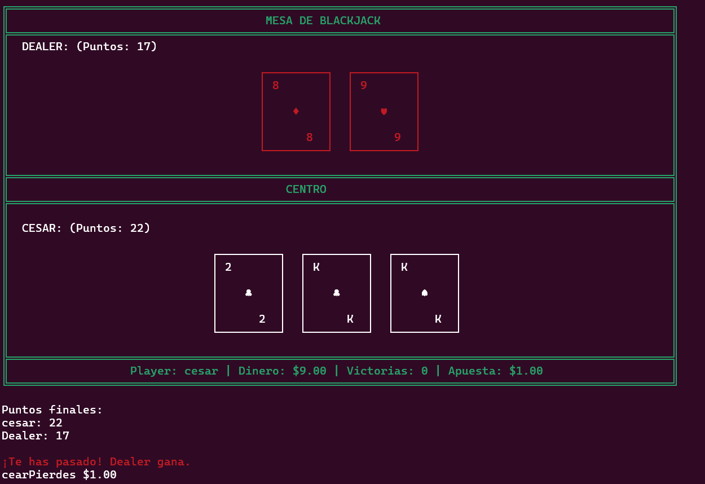

# 🃏 BlackJack Retro 

Un juego de BlackJack retro completo Interfaz Visual y Sistema Económico:
- Problemas Técnicos:
- **Java no encontrado**: Verifica que Java esté en tu PATH.
- **Error de memoria**: Asegúrate de tener suficiente RAM disponible.
- **Juego no responde**: Reinicia el terminal y vuelve a ejecutar.suales:
- **Símbolos no se ven correctamente**: Asegúrate de que tu terminal soporte UTF-8.
- **Colores no aparecen**: Algunos terminales antiguos pueden no soportar colores ANSI.
- **Mesa desalineada**: Usa un terminal con fuente monospace (Consolas, Courier New)
- Apuestas configurables (mínimo $0.50, máximo tu dinero disponible).
- Contador de victorias persistente durante la sesión.
- Ganancias 1:1 (apostar $5 = ganar $10 total).
- Interfaz ASCII art colorida y perfectamente alineada.
- Representación visual de cartas con colores diferenciados (rojas y negras).
- Mesa de 100 caracteres de ancho con alineación perfecta.
- Información en tiempo real: dinero, victorias y apuesta actual.a terminal con interfaz ASCII art, sistema de apuestas, sonidos de 8 bits y personalización del jugador.

## 🚀 Descarga y Ejecución Rápida

1. **Descarga** el archivo `blackjack-retro.jar` desde esta release.
2. **Ejecuta** en tu terminal:

   ```bash
   java -jar blackjack-retro.jar
   ```

## 📋 Requisitos

- Java 17 o superior instalado en tu sistema.
- Terminal compatible con caracteres Unicode (para los símbolos de cartas).

### ✅ Verificar instalación de Java

```bash
java -version
```

### 📦 Si no tienes Java instalado:

- **Windows**: Descarga desde [Oracle](https://www.oracle.com/java/technologies/javase-downloads.html) o instala OpenJDK.
- **Linux**:
  ```bash
  sudo apt install openjdk-17-jre       # Ubuntu/Debian  
  sudo yum install java-17-openjdk      # CentOS/RHEL
  ```
- **macOS**:
  ```bash
  brew install openjdk@17
  ```

## 🎮 Cómo Jugar

**Objetivo**: Conseguir 21 puntos o acercarse lo más posible sin pasarse y ganar dinero apostando.

### Configuración Inicial:
- Ingresa tu nombre (máximo 10 caracteres).
- Recibes $10.00 iniciales para apostar.
- Configura tu apuesta antes de cada partida (mínimo $0.50).

### Valores de cartas:
- As = 11 (o 1 si te conviene más).
- Figuras (J, Q, K) = 10.
- Números = su valor facial.

### Mecánica:
- Recibes 2 cartas iniciales con animación y sonidos.
- El dealer también recibe 2 cartas (una oculta).
- Decides si pedir más cartas (`s`) o plantarte (`n`).
- El dealer debe pedir carta si tiene menos de 17.
- Gana quien esté más cerca de 21 sin pasarse.

### Sistema de Apuestas:
- **Victoria**: Ganas el doble de tu apuesta (1:1).
- **Derrota**: Pierdes tu apuesta.
- **Empate**: Se devuelve tu apuesta.
- El juego termina si te quedas sin dinero.

## 🎯 Características

### 🎨 Interfaz Visual:
- ✨ Interfaz ASCII art colorida y perfectamente alineada.
- 🃏 Representación visual de cartas con colores diferenciados (rojas y negras).
- � Mesa de 100 caracteres de ancho con alineación perfecta.
- 📊 Información en tiempo real: dinero, victorias y apuesta actual.

### Audio Retro:
- Sonidos de 8 bits sincronizados con las acciones.
- Tonos específicos para: victoria, derrota, empate y reparto de cartas.
- Melodías ascendentes y descendentes para resultados.

### 💰 Sistema Económico:
- � Dinero inicial de $10.00.
- 🎰 Apuestas configurables (mínimo $0.50, máximo tu dinero disponible).
- � Contador de victorias persistente durante la sesión.
- 📈 Ganancias 1:1 (apostar $5 = ganar $10 total).

### Experiencia de Juego:
- Animaciones de reparto de cartas con pausas.
- Personalización con nombre del jugador.
- Partidas ilimitadas hasta quedarse sin dinero.
- Mazo que se baraja automáticamente cuando se agota.
- Compatible con Windows, Linux y macOS.

## 📸 Vista Previa



La imagen muestra una partida real con:
- **Dealer**: Cartas visibles con puntuación
- **Centro**: Área de separación elegante
- **Jugador**: Nombre personalizado, cartas y puntuación
- **Información**: Dinero disponible, victorias y apuesta actual
- **Colores**: Cartas rojas (♥♦) y negras (♠♣) diferenciadas

## 🛠️ Solución de Problemas

### 🎨 Problemas Visuales:
- ❌ **Símbolos no se ven correctamente**: Asegúrate de que tu terminal soporte UTF-8.
- 🎨 **Colores no aparecen**: Algunos terminales antiguos pueden no soportar colores ANSI.
- � **Mesa desalineada**: Usa un terminal con fuente monospace (Consolas, Courier New).

### Problemas de Audio:
- **Sin sonidos**: Verifica que tu sistema tenga audio habilitado.
- **Sonidos distorsionados**: Algunos sistemas pueden tener limitaciones con javax.sound.

### ⚙️ Problemas Técnicos:
- �🚫 **Java no encontrado**: Verifica que Java esté en tu PATH.
- 💾 **Error de memoria**: Asegúrate de tener suficiente RAM disponible.
- 🔄 **Juego no responde**: Reinicia el terminal y vuelve a ejecutar.

### Consejos de Optimización:
- **Mejor experiencia**: Usa terminal en pantalla completa.
- **Rendimiento**: Cierra aplicaciones innecesarias para mejor audio.
- **Compatibilidad**: Windows Terminal y terminales modernos funcionan mejor.

---

## 🚀 Novedades v2.0.0

### Nuevas Funcionalidades:
- **Personalización del jugador**: Ingresa tu nombre (máximo 10 caracteres).
- **Sistema de apuestas completo**: Apuesta desde $0.50 hasta todo tu dinero.
- **Contador de victorias**: Rastrea tus logros durante la sesión.
- **Gestión de dinero**: Comienza con $10 y administra tu bankroll.

### Mejoras de Audio:
- **Sonidos de 8 bits**: Tonos retro para cada acción del juego.
- **Efectos sincronizados**: Audio perfectamente coordinado con animaciones.
- **Melodías específicas**: Diferentes tonos para victoria, derrota y empate.

### Mejoras Visuales:
- **Mesa más ancha**: 100 caracteres de ancho perfectamente alineados.
- **Información en tiempo real**: Dinero, victorias y apuesta siempre visibles.
- **Animaciones mejoradas**: Reparto secuencial de cartas con pausas.
- **Centrado perfecto**: Todos los elementos alineados automáticamente.

### Mejoras de Jugabilidad:
- **Validaciones inteligentes**: Verificación automática de fondos.
- **Configuración dinámica**: Cambia tu apuesta antes de cada partida.
- **Prevención de bancarrota**: El juego termina elegantemente sin dinero.
- **Estadísticas finales**: Resumen completo al finalizar.

---

## 🤝 Contribuciones

¡Las mejoras son bienvenidas!  
Siéntete libre de abrir *issues* o *pull requests* en el repositorio.
